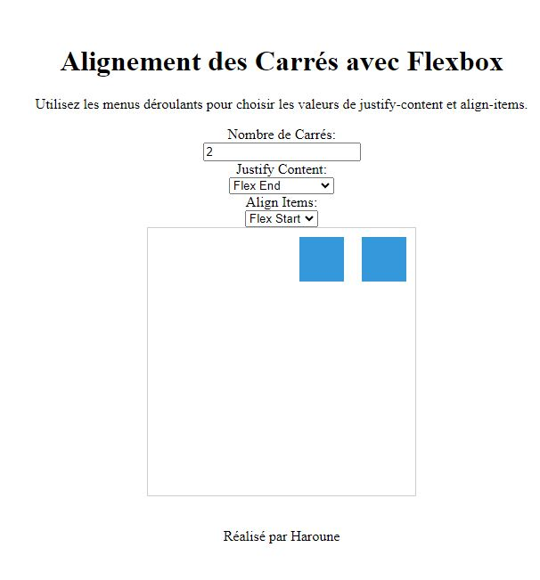

# Carrés Party avec Flexbox

## Description
Bienvenue à la Carrés Party avec Flexbox ! 🎉 Ce petit projet amusant vous permet de jouer avec des carrés et d'expérimenter différentes mises en page en utilisant Flexbox.

## Fonctionnalités
- Choisissez le nombre de carrés que vous voulez afficher.
- Utilisez les menus déroulants pour ajuster le `justify-content` et `align-items`.
- Regardez vos carrés se mettre en place en temps réel.

## Comment Utiliser
1. Clonez le repo sur votre machine locale.
2. Ouvrez le fichier `index.html` dans votre navigateur préféré.
3. Amusez-vous à jouer avec les menus et à observer les changements !

## Capture d'écran



## Exemple de Code
```html
<label for="numSquares">Nombre de Carrés:</label>
<input type="number" id="numSquares" value="9" min="1">

<label for="justifyContentSelect">Justify Content:</label>
<select id="justifyContentSelect">
  <!-- Options de justify-content -->
</select>

<label for="alignItemsSelect">Align Items:</label>
<select id="alignItemsSelect">
  <!-- Options de align-items -->
</select>

<div id="container"></div>
